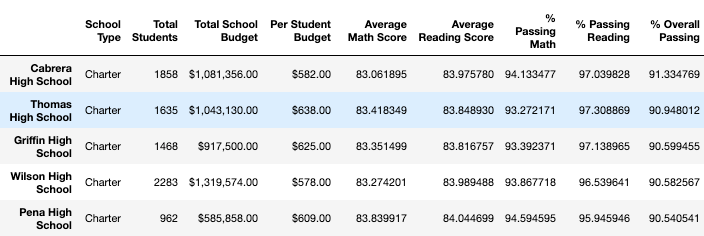
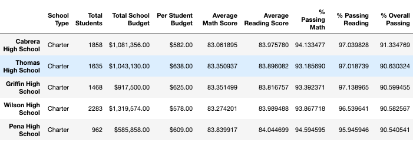

# School District Analysis

## Project Overview

This project was tasked by the Chief Data Scientest for a school district for the purpose of analyzing standardized testing data in relation to school size, type and funding. The results of this analysis are designed to reveal trends and patterns that can inform the School Board and District Superintendents about budget decisions at the district and school levels. Specifically, the relationship between standardized test performance and school budget, size and type will advise future budgeting decisions to ensure all students have the same level of support necessary to succeed.

## Results

After the initial analysis was performed, the School Board informed the Chief Data Scientist that academic dishonesty occurred at Thomas High School among students in ninth grade. The best course of action to preserve the data quality was to change the Thomas High School's ninth grade scores to NaN values, which excluded them from calculations. The code used to convert Thomas High School Math and Reading scores to NaN values was:
```
student_data_df.loc[(student_data_df["school_name"] == "Thomas High School") & (student_data_df["grade"] == "9th"), "reading_score"]=np.nan
student_data_df.loc[(student_data_df["school_name"] == "Thomas High School") & (student_data_df["grade"] == "9th"), "math_score"]=np.nan
```
Below will be a discussion of changes made to the analysis as well as how these changes affected the final analysis results. 

### District Summary

The district summary was slightly affected by the removal of Thomas High School's ninth grade test scores. All of the metrics decreased except for the average reading score. **Figure** 1 shows the district summary before removing the Thomas High School ninth grade scores, and **Figure 2** shows the district summary after removing the scores.

### Figure 1


### Figure 2


### School Summary

Removing the math and reading scores of Thomas High School ninth graders also slightly affected the school summary data set. All of the testing metrics decreased except for the average math score, which increased. This could be caused by the cheating students having a key with incorrect answers to the math section of the exam, or they only cheated on the reading section. **Figure 3** shows Thomas High School's summary statistics before the changes and **Figure 4** shows Thomas High School's summary statistics after the changes. 

### Figure 3


### Figure 4


### Thomas High School Comparative Performance

To compare all of the high schools in the district, the school summary data was used to create two data sets- the top 5 schools and the bottom 5 schools. These schools were ranked by the percentage of students who were passing both math and reading, and is listed in the dataframe as "% Overall Passing". The code for ranking the top 5 and bottom 5 schools used was:
```
# Sort and show top five schools.
top_schools = per_school_summary_df.sort_values(["% Overall Passing"], ascending=False)
top_schools.head()

# Sort and show bottom five schools.
bottom_schools = per_school_summary_df.sort_values(["% Overall Passing"])
bottom_schools.head()
```
Thomas High School remained the second best performing school despite the removal of ninth grade values from calculation. However, the percentage of students who were passing reading and math dropped from 90.95% to 90.63%. **Figure 5** shows the top 5 schools before the changes and **Figure 6** shows the top 5 schools after the changes. 

### Figure 5


### Figure 6


### Affects of Replacing Test Score Data

